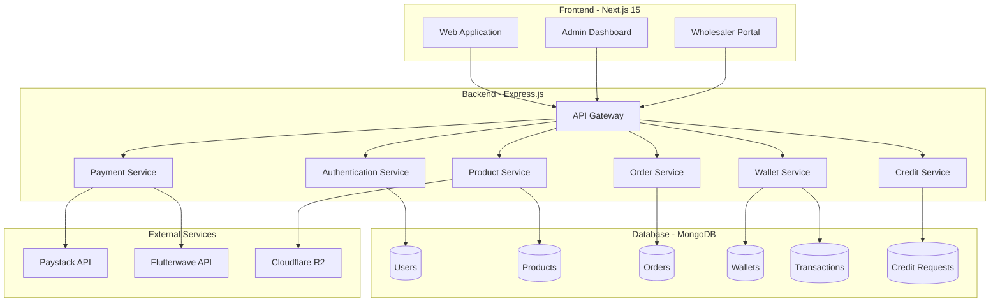
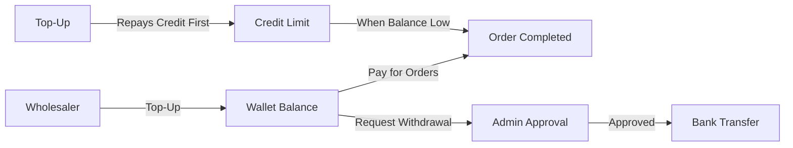
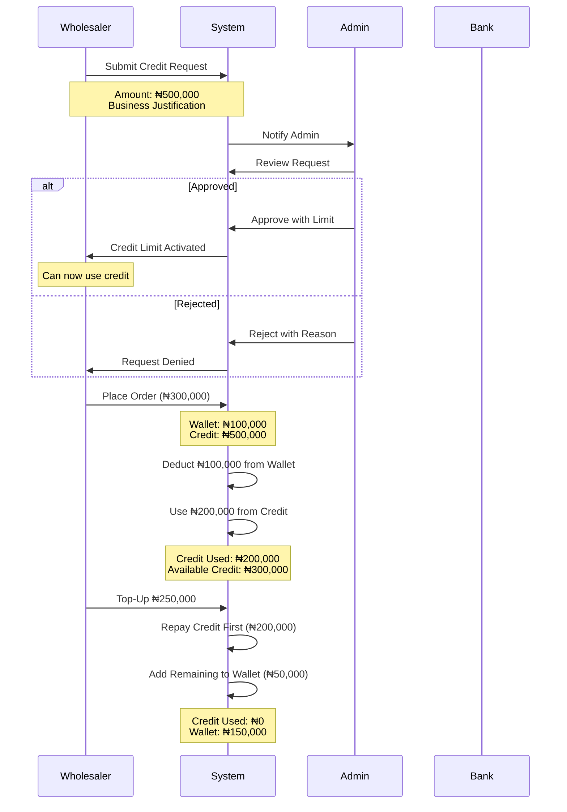
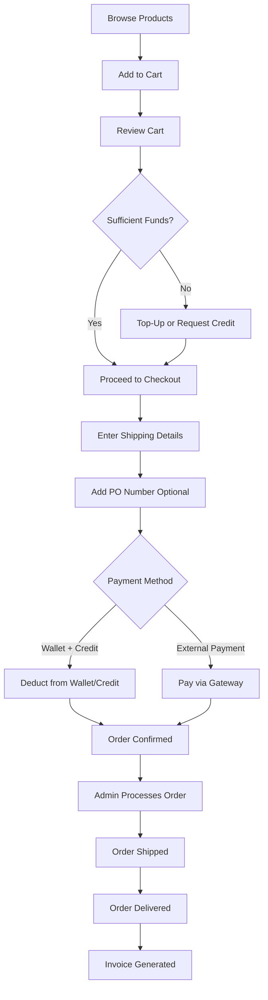
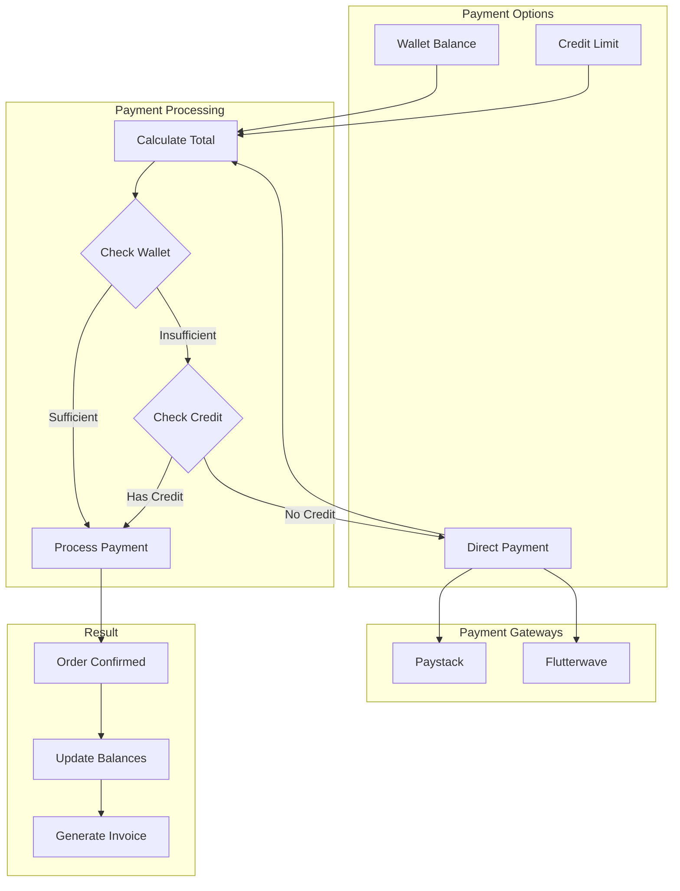

# 🏪 GloTrade E-Commerce Platform - Complete Overview

**Platform Type**: B2B Single-Seller Wholesale E-Commerce  
**Version**: 2.0 (Converted from Multi-Vendor)  
**Status**: Production Ready

---

## 📋 Table of Contents

1. [Platform Overview](#platform-overview)
2. [User Roles](#user-roles)
3. [System Architecture](#system-architecture)
4. [Core Features](#core-features)
5. [Wallet System](#wallet-system)
6. [Credit Request System](#credit-request-system)
7. [Order Flow](#order-flow)
8. [Payment Processing](#payment-processing)
9. [Admin Operations](#admin-operations)

---

## 🎯 Platform Overview

### **What is GloTrade?**

GloTrade is a **B2B wholesale e-commerce platform** designed for bulk purchasing. The platform operates as a **single-seller model** where:

- **One Admin/Seller** manages the entire product catalog
- **Multiple Wholesalers (Buyers)** purchase products in bulk quantities
- **Virtual Wallet System** enables seamless transactions
- **Credit System** provides flexible payment options

### **Platform Evolution**

```
Multi-Vendor Platform (v1.0)
         ↓
   Conversion Process
         ↓
Single-Seller B2B Platform (v2.0)
```

**Key Changes**:
- ✅ Removed vendor registration and management
- ✅ Centralized product management under admin
- ✅ Added wholesale-specific features (bulk pricing, credit limits)
- ✅ Implemented wallet system for B2B transactions
- ✅ Added credit request workflow for business customers

---

## 👥 User Roles

### **1. Admin (Seller)**

**Responsibilities**:
- Manage entire product catalog
- Process orders and shipments
- Review and approve credit requests
- Process withdrawal requests
- Manage user accounts
- Monitor platform analytics

**Access Level**: Full platform control

---

### **2. Wholesaler (Buyer)**

**Responsibilities**:
- Browse and purchase products in bulk
- Manage wallet balance
- Request credit limits
- Submit withdrawal requests
- Track orders and invoices

**Access Level**: Customer-facing features only

---

## 🏗️ System Architecture

### **High-Level Architecture**



### **Technology Stack**

| Layer | Technology | Purpose |
|-------|-----------|---------|
| **Frontend** | Next.js 15 | Server-side rendering, routing |
| **Styling** | Tailwind CSS | Responsive UI design |
| **Backend** | Express.js + TypeScript | RESTful API server |
| **Database** | MongoDB + Mongoose | Document storage |
| **Authentication** | JWT | Secure token-based auth |
| **Payment** | Paystack, Flutterwave | Payment processing |
| **Storage** | Cloudflare R2 | File/image storage |
| **Real-time** | Server-Sent Events | Live notifications |

---

## 🚀 Core Features

### **1. Product Management**

**Admin Capabilities**:
- Create/edit/delete products
- Upload product images (Cloudflare R2)
- Set bulk pricing tiers
- Manage inventory levels
- Organize products in 3-level categories

**Bulk Pricing Example**:
```
Product: Premium Rice (50kg bag)
- 1-9 bags: ₦25,000 each
- 10-49 bags: ₦23,000 each (8% discount)
- 50+ bags: ₦21,000 each (16% discount)
```

---

### **2. Order Management**

**Order Lifecycle**:
```
Cart → Checkout → Payment → Processing → Shipped → Delivered
```

**Features**:
- Shopping cart with quantity management
- Bulk pricing calculation
- Purchase order (PO) number support
- Automatic invoice generation (PDF)
- Order status tracking
- Email notifications at each stage

---

### **3. Business Account Features**

**Business Registration**:
- Company name and registration number
- Tax ID (TIN)
- Business address
- Admin verification required

**Benefits**:
- Access to credit limits
- Net payment terms
- Bulk pricing discounts
- Invoice generation
- Purchase order tracking

---

## 💼 Wallet System

### **How It Works**

The wallet system is a **virtual balance system** that enables seamless transactions on the platform.



### **Wallet Features**

#### **1. Top-Up (Add Funds)**

**Process**:
1. Wholesaler clicks "Top-Up Wallet"
2. Enters amount (minimum ₦1,000)
3. Selects payment method (Paystack/Flutterwave)
4. Completes payment via payment gateway
5. Wallet balance updated automatically

**Payment Methods**:
- Bank transfer
- Card payment
- USSD
- Bank account

---

#### **2. Withdrawal (Cash Out)**

**Process**:
1. Wholesaler submits withdrawal request
2. Provides bank account details
3. Admin reviews request
4. Admin approves/rejects
5. If approved, funds transferred to bank account

**Validation**:
- Minimum withdrawal: ₦5,000
- Must have sufficient balance
- Bank account must be verified

---

#### **3. Transaction History**

**Features**:
- Complete audit trail of all transactions
- Filter by type (top-up, withdrawal, payment, refund)
- Filter by date range
- Export to CSV/Excel
- Real-time balance updates

**Transaction Types**:
- **Deposit**: Top-up via payment gateway
- **Payment**: Order payment
- **Withdrawal**: Cash out to bank
- **Refund**: Order cancellation refund
- **Adjustment**: Admin manual adjustment

---

## 💳 Credit Request System

### **Overview**

The credit system allows verified wholesalers to purchase products **beyond their wallet balance** using approved credit limits.

### **How It Works**



### **Credit Request Workflow**

#### **Step 1: Wholesaler Submits Request**

**Required Information**:
- Requested credit amount
- Business justification
- Expected monthly order volume
- Business documents (optional)

**Eligibility**:
- ✅ Verified business account
- ✅ Active account (30+ days)
- ✅ Good payment history
- ✅ No pending credit requests

---

#### **Step 2: Admin Reviews Request**

**Admin Dashboard View**:
```
Credit Request #CR-2024-001
━━━━━━━━━━━━━━━━━━━━━━━━━━━━━━━━━━━
Wholesaler: ABC Trading Ltd
Requested Amount: ₦500,000
Current Wallet Balance: ₦50,000
Order History: 15 orders, ₦2.5M total
Payment History: 100% on-time
Account Age: 90 days
Justification: "Expanding inventory for Q1 2025"

[Approve] [Reject]
```

**Admin Considerations**:
- Order history and volume
- Payment track record
- Account age and activity
- Business verification status
- Current wallet balance
- Requested amount vs. order patterns

---

#### **Step 3: Decision & Notification**

**If Approved**:
1. Credit limit added to wallet
2. Wholesaler receives email notification
3. Credit becomes available immediately
4. Visible in wallet dashboard

**If Rejected**:
1. Request marked as rejected
2. Wholesaler receives email with reason
3. Can submit new request after 7 days

---

### **Credit Usage**

#### **Payment Priority**

When placing an order:

```
Order Total: ₦300,000

Payment Calculation:
1. Check Wallet Balance: ₦100,000
2. Remaining Needed: ₦200,000
3. Check Available Credit: ₦500,000 ✓
4. Deduct from Wallet: ₦100,000
5. Use Credit: ₦200,000
6. Order Confirmed ✓

Result:
- Wallet Balance: ₦0
- Credit Used: ₦200,000
- Available Credit: ₦300,000
```

---

#### **Credit Repayment**

**Automatic Repayment on Top-Up**:

```
Scenario: Credit Used = ₦200,000
Wholesaler tops up ₦250,000

Repayment Process:
1. Top-up amount: ₦250,000
2. Pay down credit first: ₦200,000
3. Remaining to wallet: ₦50,000

Result:
- Credit Used: ₦0
- Available Credit: ₦500,000 (full limit restored)
- Wallet Balance: ₦50,000
```

**Key Points**:
- ✅ Credit is **always repaid first** on top-ups
- ✅ No manual repayment needed
- ✅ Credit limit is **revolving** (resets when repaid)
- ✅ No interest or fees on credit usage

---

### **Credit Limits & Monitoring**

**Wholesaler Dashboard View**:
```
┌─────────────────────────────────────┐
│ Wallet Overview                     │
├─────────────────────────────────────┤
│ Wallet Balance:      ₦50,000        │
│ Credit Limit:        ₦500,000       │
│ Credit Used:         ₦200,000       │
│ Available Credit:    ₦300,000       │
│ Total Available:     ₦350,000       │
└─────────────────────────────────────┘
```

**Admin Monitoring**:
- View all credit limits across wholesalers
- Track credit utilization rates
- Identify high-risk accounts
- Adjust limits based on performance
- Freeze credit for non-payment

---

## 🛒 Order Flow

### **Complete Order Journey**



### **Order Details**

**Information Captured**:
- Product details and quantities
- Bulk pricing applied
- Shipping address
- Purchase order number (optional)
- Payment method used
- Wallet/credit breakdown

**Generated Documents**:
- Order confirmation email
- PDF invoice (auto-generated)
- Shipping notification
- Delivery confirmation

---

## 💰 Payment Processing

### **Payment Flow Architecture**



### **Payment Methods**

| Method | Use Case | Processing Time |
|--------|----------|----------------|
| **Wallet Balance** | Primary payment method | Instant |
| **Credit Limit** | When wallet insufficient | Instant |
| **Paystack** | Direct payment/top-up | 1-5 minutes |
| **Flutterwave** | Direct payment/top-up | 1-5 minutes |

---

## 👨‍💼 Admin Operations

### **Admin Dashboard**

**Key Metrics**:
- Total revenue
- Active orders
- Pending credit requests
- Pending withdrawal requests
- Low stock alerts
- User registrations

### **Admin Workflows**

#### **1. Credit Request Management**

```
Daily Routine:
1. Check pending credit requests
2. Review wholesaler history
3. Approve/reject with notes
4. Monitor credit utilization
```

#### **2. Withdrawal Processing**

```
Daily Routine:
1. Review withdrawal requests
2. Verify bank account details
3. Check wallet balance
4. Approve and process payout
5. Update transaction status
```

#### **3. Order Management**

```
Order Processing:
1. Receive order notification
2. Verify payment
3. Prepare products
4. Update status to "Shipped"
5. Add tracking information
6. Confirm delivery
```

#### **4. Wallet Management**

**Admin Controls**:
- View all wallet balances
- Freeze/unfreeze wallets
- Manual adjustments (with notes)
- Transaction monitoring
- Export transaction reports

---

## 🔒 Security & Compliance

### **Security Features**

- ✅ JWT token authentication
- ✅ Role-based access control
- ✅ Input validation on all forms
- ✅ SQL injection prevention
- ✅ XSS protection
- ✅ CSRF protection
- ✅ Secure password hashing (bcrypt)

### **Audit Trails**

**All critical operations are logged**:
- Credit request approvals/rejections
- Withdrawal approvals/rejections
- Wallet freeze/unfreeze actions
- Manual wallet adjustments
- Order status changes
- Payment transactions

---

## 📊 Reporting & Analytics

### **Wholesaler Reports**

- Order history
- Transaction history
- Credit usage reports
- Spending analytics
- Invoice downloads

### **Admin Reports**

- Sales reports (daily/weekly/monthly)
- Revenue analytics
- Credit utilization reports
- Withdrawal processing reports
- User activity reports
- Product performance reports

---

## 🚀 Getting Started

### **For Wholesalers**

1. **Register Account**
   - Provide business details
   - Submit for verification
   - Wait for admin approval

2. **Set Up Wallet**
   - Top-up initial balance
   - Request credit limit (optional)
   - Start shopping

3. **Place Orders**
   - Browse products
   - Add to cart
   - Checkout with wallet/credit
   - Track delivery

### **For Admins**

1. **Initial Setup**
   - Add products to catalog
   - Set bulk pricing tiers
   - Configure payment gateways
   - Set up bank account

2. **Daily Operations**
   - Process orders
   - Review credit requests
   - Process withdrawals
   - Monitor analytics

---

## 📞 Support

### **Wholesaler Support**

- Email: support@glotrade.com
- Phone: +234-810-7060-160
- Business Hours: Mon-Fri, 9AM-5PM WAT

### **Technical Support**

- Developer Email: dev@glotrade.com
- Documentation: `/docs` folder
- API Documentation: Coming soon

---

## 📝 Changelog

### **Version 2.0** (Current)
- ✅ Converted to single-seller B2B model
- ✅ Implemented wallet system
- ✅ Added credit request workflow
- ✅ Added withdrawal request system
- ✅ Enhanced bulk pricing
- ✅ Added business account verification

### **Version 1.0** (Legacy)
- Multi-vendor marketplace
- Basic payment integration
- Standard e-commerce features

---

**Last Updated**: December 4, 2025  
**Platform Status**: Production Ready  
**Documentation Version**: 2.0
