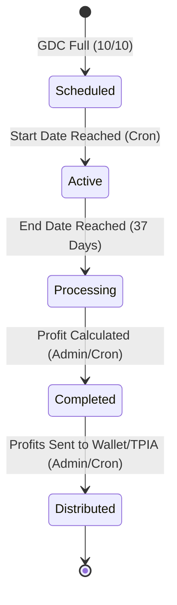
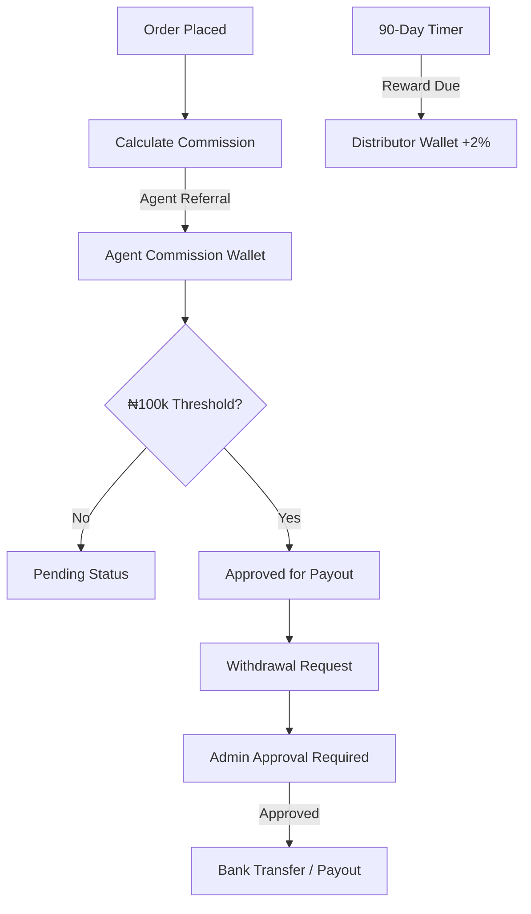
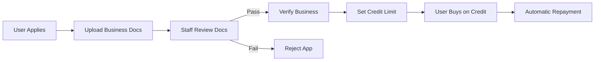

# Admin & staff Operations — System Management

> [!TIP]
> For a detailed technical breakdown of every folder and file in the admin directory, see the **[Admin Folder Reference](file:///Users/harz/Documents/backUps/glotrade_ecom/docs/training/ADMIN_FOLDER_REFERENCE.md)**.

This document outlines the critical workflows that administrators and staff must perform to keep the Glotrade ecosystem running efficiently.

## 1. Trade Cycle Lifecycle Management

Trade cycles are the engine of the GDIP system. While most processes are automated via cron jobs, admins must oversee the lifecycle.

### Critical Admin Tasks
1. **GDC Monitoring**: Ensure clusters are filling sequentially.
2. **Commodity Management**: Update available commodity types and market prices.
3. **Cycle Verification**: Verify that profit calculations (target 5%) align with actual commodity trade results.
4. **Profit Distribution**: Execute the distribution for processing cycles.

## 2. Commission & Financial Oversight

Managing the multi-tier agent network, distributor rewards, and corporate credit.

### Intensive Financial Logic:
- **Commission Threshold**: Agents must reach **₦100,000** in pending commissions before they are auto-approved for payout.
- **Distributor Rewards**: Every 90 days, Distributors earn **2%** of their total wallet balance. Admins monitor this via `DistributorService` logs.
- **Credit Oversight**: Wholesalers/Distributors apply for credit limits. Admins must verify business documents before assigning a limit.

## 3. Two-Tiered Verification & Credit Workflow

To protect the platform's liquidity, specialized roles require rigorous vetting.

### Verification Tiers:
- **Tier 1 (Identity)**: Standard KYC for all registered users. Verified via `admin/users`.
- **Tier 2 (Business)**: Corporate vetting for Wholesalers & Distributors. Approved via the **"Verify Business"** action in the User Detail modal.

### Business Credit Workflow:

## Staff Checklist

| Task | Frequency | Action |
| :--- | :--- | :--- |
| **User Verification** | Daily | Review uploaded IDs and approve basic platform access. |
| **Business Vetting** | Daily | Verify business documents for corporate partners and enable GDIP/Credit features. |
| **Withdrawal Processing** | Weekly | Approve and process pending payout requests (Check Bank Details). |
| **Commodity Management** | Bi-Weekly | Update market prices and CRUD for listed commodities. |
| **Cycle Monitoring** | Weekly | Oversee active 37-day cycles to ensure smooth automation. |

---

**GloTrade — A Multi-Role Commerce & Distribution Infrastructure**
Developer: NEXGEN TECH INNOVATIONS LIMITED
Contact: codewithharz@gmail.com | +2348107060160
