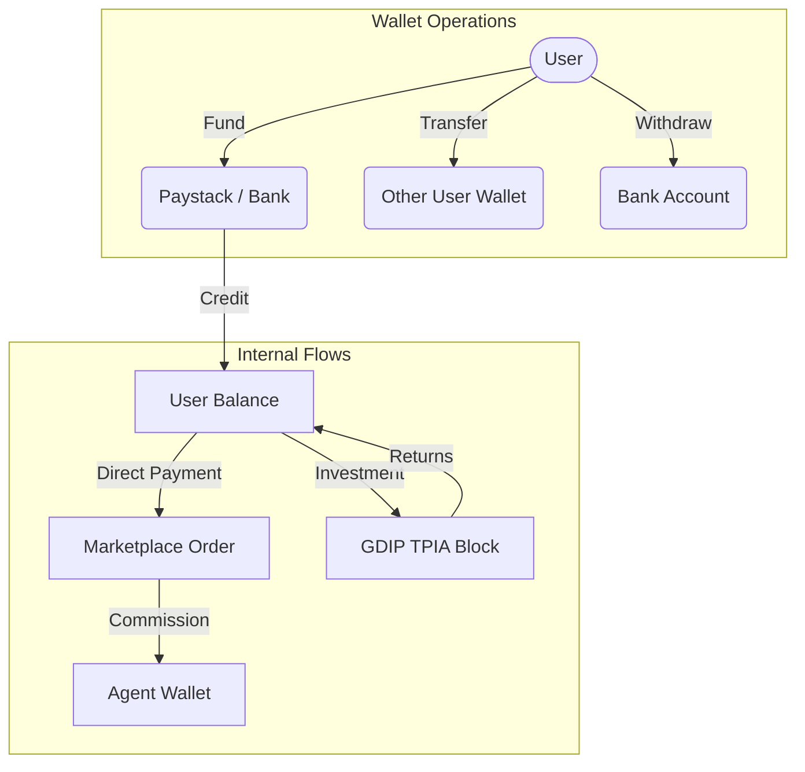
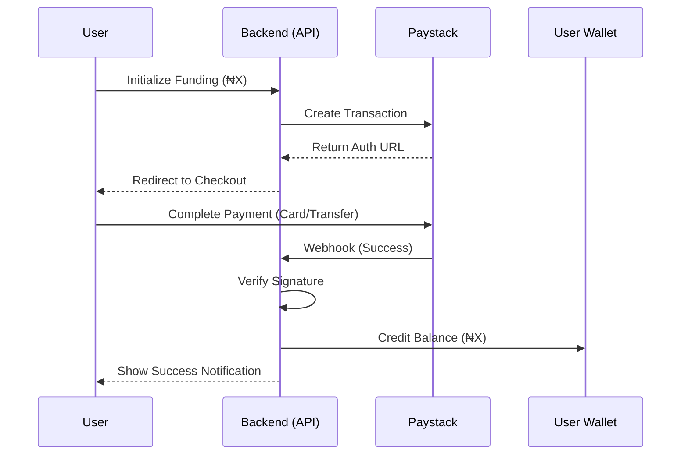

# FinTech Structure — Wallet & Payment Architecture

This document explains the underlying financial mechanisms that power the Glotrade ecosystem, including the wallet system and payment gateway integrations.

## 1. Unified Wallet System

Every registered user (Customer, Agent, Partner, Admin) has a digital wallet that tracks value across three technical states.

### Intensive Balance Logic:
- **Available Balance**: Spendable funds for marketplace orders or TPIA purchases.
- **Frozen Balance**: Funds committed to active trade cycles or pending orders.
- **Credit Layer**: Wholesalers and Distributors can access a **Credit Limit**. If the available balance is insufficient, the system auto-deducts from the credit line.

## 2. Payment Gateway Lifecycle (Paystack)

The platform integrates with Paystack for secure, PCI-compliant payment processing.

## 3. Escrow & Security

For many transactions, the platform acts as a trusted intermediary.

- **Marketplace Orders**: Funds are held (virtual escrow) until the delivery is confirmed by the buyer or a set time has passed.
- **GDIP Investments**: Capital is pooled into GDCs (₦10,000,000 each) and backed by a 13-digit insurance certificate.
- **Withdrawals**: All withdrawals undergo a verification process (KYC check + Balance check) before being pushed to the processing queue.

## Transaction Types Reference

| Type | Direction | Description |
| :--- | :--- | :--- |
| `payment` | Debit | Buying goods from the marketplace. |
| `funding` | Credit | Adding money to the wallet via Paystack. |
| `transfer` | Debit/Credit | Sending money to another registered user. |
| `investment` | Debit | Purchasing a TPIA block (₦1M). |
| `earning` | Credit | ROI from trade cycles or MLM commissions. |
| `payout` | Debit | Withdrawing funds to a physical bank account. |

---

**GloTrade — A Multi-Role Commerce & Distribution Infrastructure**
Developer: NEXGEN TECH INNOVATIONS LIMITED
Contact: codewithharz@gmail.com | +2348107060160
