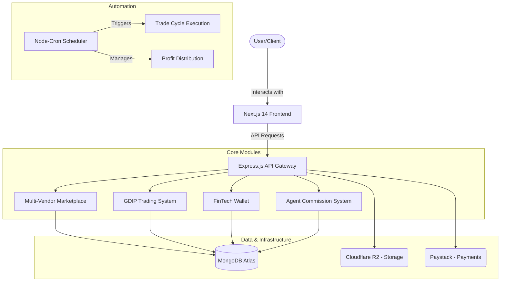

# System Overview — NEXGEN TECH INNOVATIONS LIMITED

This document provides a high-level overview of the Glotrade International Platform ecosystem, its core components, and how they interact.

## The Big Picture

The Glotrade platform is a unified enterprise ecosystem combining Multi-Vendor E-Commerce, FinTech Infrastructure, and a sophisticated Commodity-Backed Investment engine (GDIP).

For deep technical details, refer to the **[Intensive Feature Reference](file:///Users/harz/Documents/backUps/glotrade_ecom/docs/training/INTENSIVE_FEATURE_REFERENCE.md)**.

## Core Ecosystem Components

| Component | Description | Primary Users |
| :--- | :--- | :--- |
| **Marketplace** | A multi-vendor e-commerce system for buying and selling products. | Customers, Vendors |
| **FinTech Wallet** | A digital wallet for handling payments, transfers, and earnings. | All registered users |
| **GDIP System** | Glotrade Distribution/Trusted Insured Partners — commodity-backed trading. | Partners, Admins |
| **MLM System** | Multi-level marketing and referral commission tracking. | Sales Agents |
| **Business Credit** | Application-based credit limits for corporate buyers. | Wholesalers, Distributors |

## Technology Stack

- **Frontend**: Next.js 14 (App Router), TypeScript, Tailwind CSS
- **Backend**: Node.js, Express.js, TypeScript
- **Database**: MongoDB with Mongoose ODM
- **Payment Gateway**: Paystack
- **Storage**: Cloudflare R2
- **Hosting**: Render (API), Vercel (Frontend)

---

**GloTrade — A Multi-Role Commerce & Distribution Infrastructure**
Developer: NEXGEN TECH INNOVATIONS LIMITED
Contact: codewithharz@gmail.com | +2348107060160
