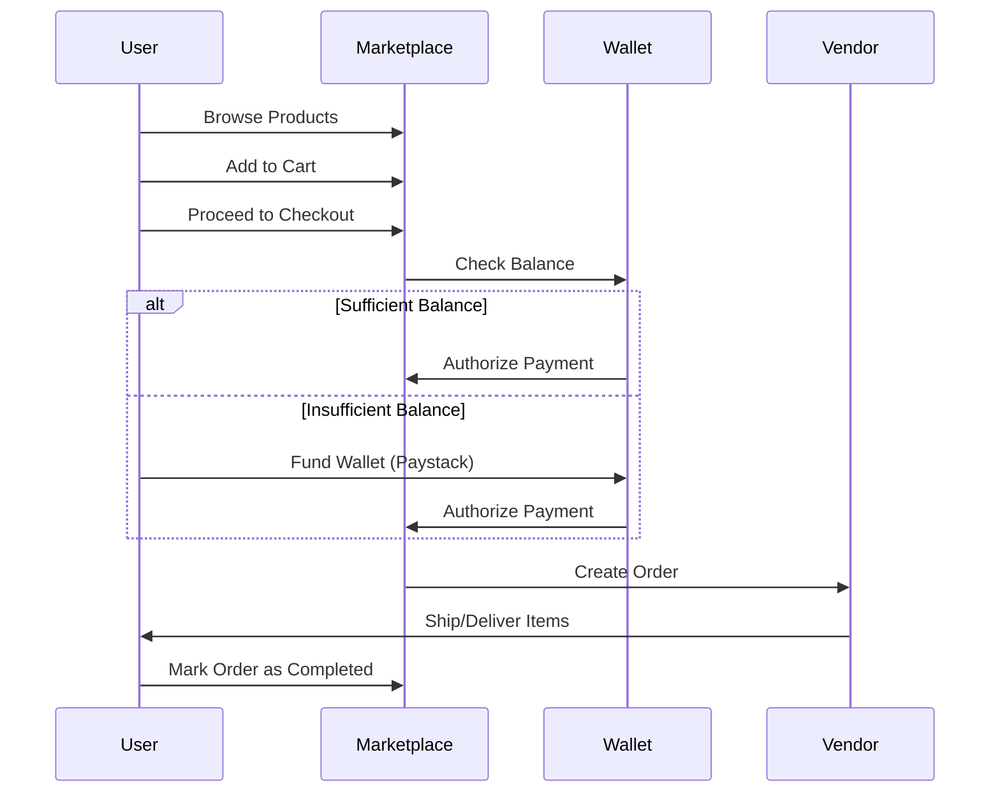

# User & Partner Journey — How It Works

This guide explains the step-by-step process of using the Glotrade platform as a general customer or as a Trusted Insured Partner (GDIP).

## 1. General User Journey (Customer)

The flow for a standard customer buying goods from the marketplace.



## 2. GDIP Partner Journey (Investment)

The specialized flow for high-value partners purchasing Trade Partners Insured Alliance (TPIA) blocks (₦1,000,000 each).

### Technical Constraints:
- **Sequential Filling**: Partners fill GDC slots in order (1 through 10).
- **Formulaic ID**: Your TPIA ID is calculated as `(GDC Number - 10) + Role Slot`.
- **Auto-Activation**: Once slot 10 is filled, the **37-day Trade Cycle** begins automatically.

```mermaid
graph LR
    Reg[Registration & KYC] --> Wallet[Fund Wallet >= ₦1M]
    Wallet --> Purchase[Purchase TPIA Block]
    Purchase --> Insurance[Insurance Certificate Issued]
    Insurance --> GDC[Assign to GDC Cluster]
    GDC -->|GDC Full 10/10| Cycle[Trade Cycle Starts]
    Cycle -->|37 Days| Profit[Profit Generated (5% Target)]
    Profit -->|EPS Mode| Payout[Payout to Wallet]
    Profit -->|TPM Mode| Compound[Compound to TPIA Value]
    Payout --> NewCycle[Next Cycle Automatic]
    Compound --> NewCycle
```

## Partner Role Breakdown

| Role | Access Level | Primary Capability |
| :--- | :--- | :--- |
| **Guest** | Public | Browse products, see prices. |
| **Customer** | Registered | Full marketplace access, wallet, order tracking. |
| **Sales Agent** | Portal | Generate referral links, earn commissions on referrals. |
| **Wholesaler** | Portal | Access bulk pricing, apply for business credit. |
| **Distributor** | Portal | Advanced inventory tools and bulk operations. |
| **Trusted Partner** | GDIP | Purchase TPIAs and earn ROI on 37-day cycles. |

---

**GloTrade — A Multi-Role Commerce & Distribution Infrastructure**
Developer: NEXGEN TECH INNOVATIONS LIMITED
Contact: codewithharz@gmail.com | +2348107060160
